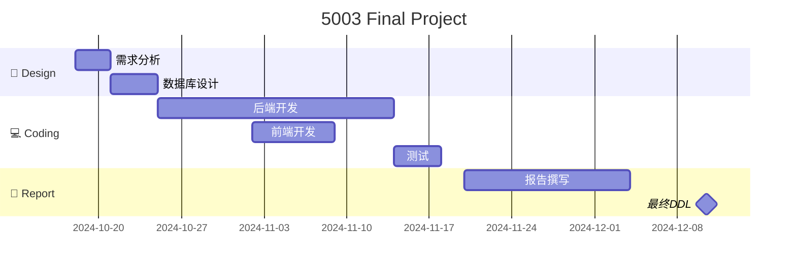

| **任务**        | **开始日期** | **结束日期** | **持续时间** |
|----------------|--------------|--------------|--------------|
| 需求分析       | 2024-10-18   | 2024-10-20   | 3 天         |
| 数据库设计     | 2024-10-21   | 2024-10-29   | 7 天         |
| 后端开发       | 2024-10-25   | 2024-11-14   | 20 天        |
| 前端开发       | 2024-11-02   | 2024-11-08   | 7 天         |
| 测试           | 2024-11-15   | 2024-11-18   | 4 天         |
| 报告撰写       | 2024-11-20   | 2024-12-03   | 14 天        |
| 最终DDL        | 2024-12-10   | 2024-12-10   |  |

**后端**

- **Flask** **（Django)**
- **SQLite**

**前端**

- **Vue**
- **Flask-SocketIO** 

```bash
/project
│── /backend                # Flask 后端
│   ├── app.py              # Flask 主程序
│   ├── models.py           # 数据库操作
│   ├── requirements.txt    # Python 依赖包
│   └── courses.db          # SQLite 数据库

│── /frontend               # Vue 前端
│   ├── /src
│   │   ├── App.vue         # Vue 主组件
│   │   └── main.js         # Vue 项目入口
│   └── package.json        # npm 依赖包

```

