# 5003_Project

## 项目部署

### 后端部分

- **SuperUser:**
  - haoyuan pw: 123456（通过localhost:8888/admin管理后台）
- **运行：**
  - 根目录（backend\myproject\）下运行`python manage.py runserver`

### 前端部分

- **运行：**
  - `npm run serve 8888`

### 测试数据

- **Student**
  - Alice 123456alice alice@example.com sid:1
  - Lotus 123456lotus lotus@example.com sid:2


## 项目计划

### 时间线

```mermaid
gantt
    title 5003 Final Project
    dateFormat  YYYY-MM-DD

    %% Design Phase
    section 🎨 Design
    需求分析           :des1, 2024-10-18, 3d
    数据库设计         :des2, after des1, 4d

    %% Coding Phase
    section 💻 Coding
    后端开发           :dev1, 2024-10-25, 20d
    前端开发           :dev2, 2024-11-2, 7d
    测试               :test, after dev1, 4d

    %% Report Phase
    section 📝 Report
    报告撰写           :dep1, 2024-11-20, 14d
    最终DDL           :milestone, dep2, 2024-12-10, 1d

```



| **任务**       | **开始日期**   | **结束日期**   | **持续时间** |
| -------------- | -------------- | -------------- | ------------ |
| ~~需求分析~~   | ~~2024-10-18~~ | ~~2024-10-20~~ | ~~3 天~~     |
| ~~数据库设计~~ | ~~2024-10-21~~ | ~~2024-10-29~~ | ~~7 天~~     |
| 后端开发       | 2024-10-25     | 2024-11-14     | 20 天        |
| 前端开发       | 2024-11-02     | 2024-11-08     | 7 天         |
| 测试           | 2024-11-15     | 2024-11-18     | 4 天         |
| 报告撰写       | 2024-11-20     | 2024-12-03     | 14 天        |
| 最终DDL        | 2024-12-10     | 2024-12-10     |              |

### 文件架构

```
course-team-system/
│
├── backend/                  # Django 项目目录
│   ├── Dockerfile            # Django 的 Dockerfile
│   ├── requirements.txt      # Django 依赖
│   └── myproject/            # Django 核心项目目录
│       ├── manage.py
│       ├── db.sqlite3        # SQLite 数据库文件
│       ├── myapp/            # Django 应用
│       │   ├── models.py     # 数据库模型
│       │   ├── views.py      # API 视图
│       │   ├── serializers.py # 序列化器
│       │   └── urls.py       # 应用的URL配置
│       └── settings.py       # Django 配置文件
│
├── frontend/                 # Vue 项目目录
│   ├── Dockerfile            # Vue 的 Dockerfile
│   └── src/                  # Vue 项目源码
│       ├── components/       # Vue组件
│       ├── router/
|       |   └── index.js      # 前端路由分发
│       ├── App.vue
│       └── main.js
│
├── docker-compose.yml        # Docker编排文件
└── README.md                 # 项目说明

```

### 项目逻辑

- **用户登录**
  - 用户在登录页面输入凭据
  - 如果身份验证失败，页面会弹出错误信息
  - 如果身份验证成功，则生成 JWT 令牌，并转到学生信息页面
  - 如果用户试图通过 URL 访问其他学生的信息，则返回无权限的错误页面，并重定向到自己的学生信息
  - 如果未登录用户通过 URL 直接访问学生信息页面，则会被重定向到错误页面，提示需要登录


### TODO：
 - 修改个人信息
 - 修改队伍信息
 - 登出